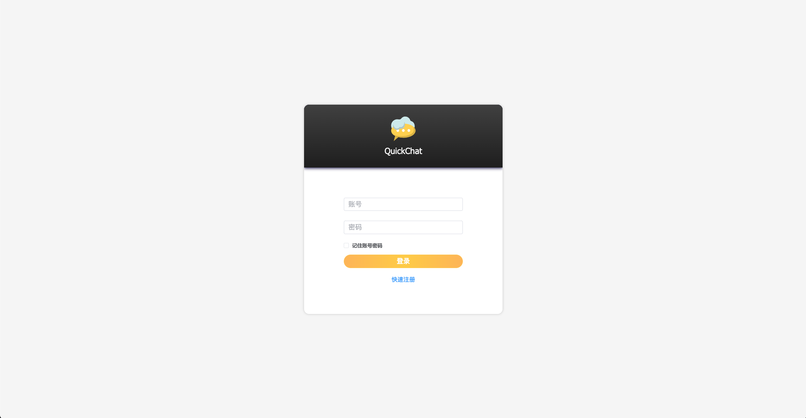
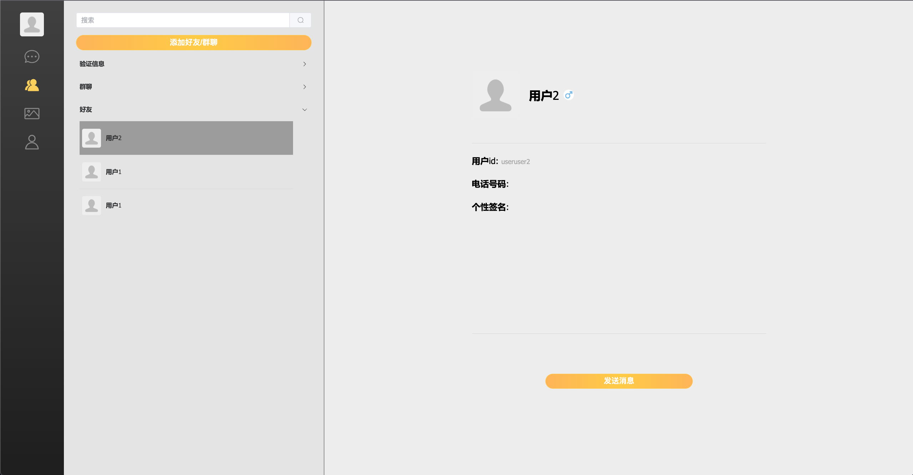
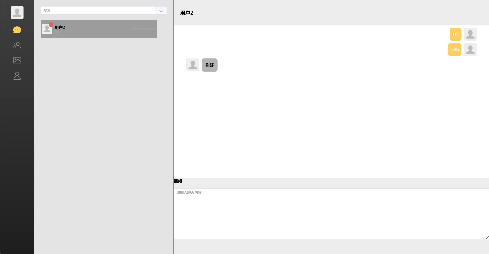
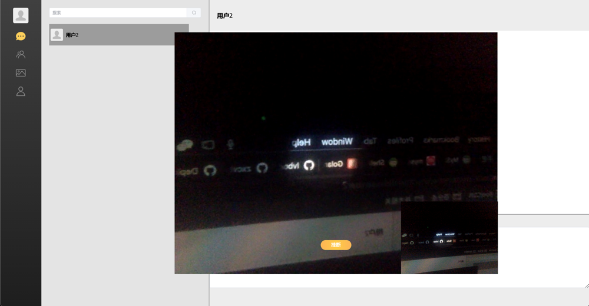

# quick-chat
web端音视频实时通讯的demo项目，适合学习研究和二次开发。

## 预览
**预览地址**：[https://lvboda.cn/quick-chat](https://lvboda.cn/quick-chat)

**测试用户1账号/密码**：useruser1/123456

**测试用户2账号/密码**：useruser2/123456

> 注意：请不要在一个浏览器同时登陆两个账号！

<div align="center">


**登陆**


**消息**


**联系**


**文字**


**视频**

</div>

## 功能
- [x] 注册
- [x] 登陆
- [ ] 退出
- [x] 添加好友
- [ ] 添加群
- [x] 好友验证
- [ ] 群验证
- [x] 文字实时通讯
- [x] 视频实时通讯
- [ ] 音频实时通讯
- [ ] 群文字实时通讯
- [ ] 群视频实时通讯
- [ ] 群文字实时通讯
- [ ] 图片/文件传输
- [ ] 朋友圈

> 群聊的相关功能以及图片/文件传输后端都已经实现，前端部分未开发，如果有需要请自行二次开发。
>
> 音频实时通讯的逻辑与视频实时通讯逻辑相同，如果有需要请自行二次开发。

## 开发
### 目录结构
```
├── api                                             apis
├── assets                                          静态文件存储目录
├── config                                          配置文件目录
├── database                                        DDL
├── logs                                            log存储目录
├── middleware                                      中间件
├── model                                           model层
├── router                                          路由表
├── service                                         service层
├── utils                                           工具包
├── web                                             web端
│   ├── dist                                        打包输出
│   ├── node_modules                                三方库
│   ├── public                                      静态资源
│   ├── src                                         前端开发目录
│   │   ├── api                                     接口
│   │   ├── assets                                  静态资源
│   │   ├── components                              通用组件
│   │   ├── hooks                                   hooks
│   │   ├── layouts                                 布局组件
│   │   ├── plugins                                 插件
│   │   ├── router                                  路由
│   │   ├── stores                                  全局数据存储
│   │   ├── styles                                  通用样式
│   │   ├── utils                                   工具包
│   │   ├── views                                   页面
│   │   ├── App.vue                                 根组件
│   │   └── main.ts                                 入口
│   └── .env.*                                      环境变量
├── .air.toml                                       air配置文件
├── api_test.http                                   接口测试文件
├── main.go                                         入口
├── go.mod
├── go.sum
```

### 技术选型
**后端**：go + gin + gorm + jwt-go + websocket ...

**前端**：vue + vue-router + pinia + axios + simple-peer ...

**数据库**：mysql

### 本地运行

#### 后端
``` bash
# 安装依赖
go mod download

# 安装air，出现版本号即为成功，若未安装成功请查看官方文档
curl -sSfL https://raw.githubusercontent.com/cosmtrek/air/master/install.sh | sh -s -- -b $(go env GOPATH)/bin

air -v

# 启动
air
```

> 注意：本项目后端使用air进行热重启，需要在本地全局安装air并确保配置了air环境变量，否则启动后端服务可能会出现路径问题，[air官方文档](https://github.com/cosmtrek/air)。

#### 前端
``` bash
# 安装依赖
npm install

# 启动
npm run dev
```

#### 数据库
``` sql
-- 创建库
CREATE DATABASE quick_chat

USE quick_chat

-- 执行DDL，文件位置：./database/quick_chat.sql
SOURCE quick_chat.sql
```

> 注意：后端没有使用orm框架的自动迁移，需要提前手动建表。

### 开发思路
思路与更详细的开发流程请查看文章。

## 许可

[MIT](./LICENSE)

Copyright (c) 2022 - Boda Lü
